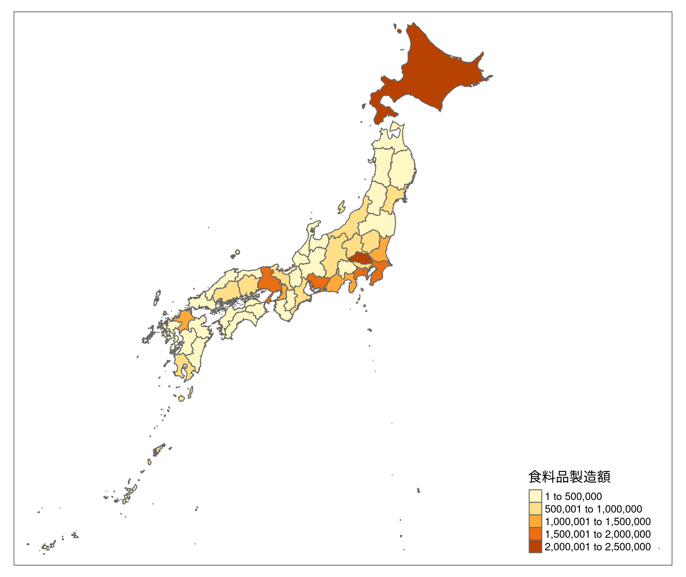
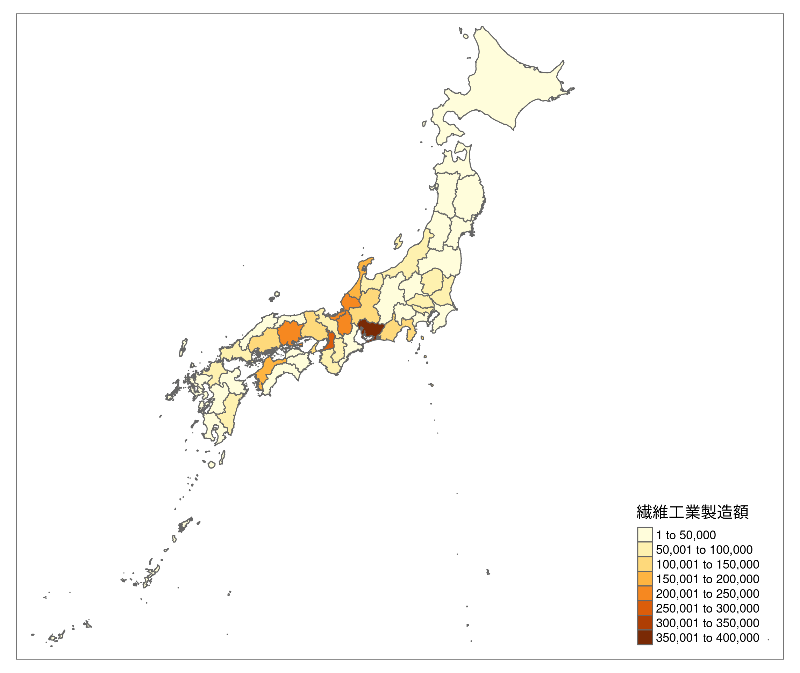
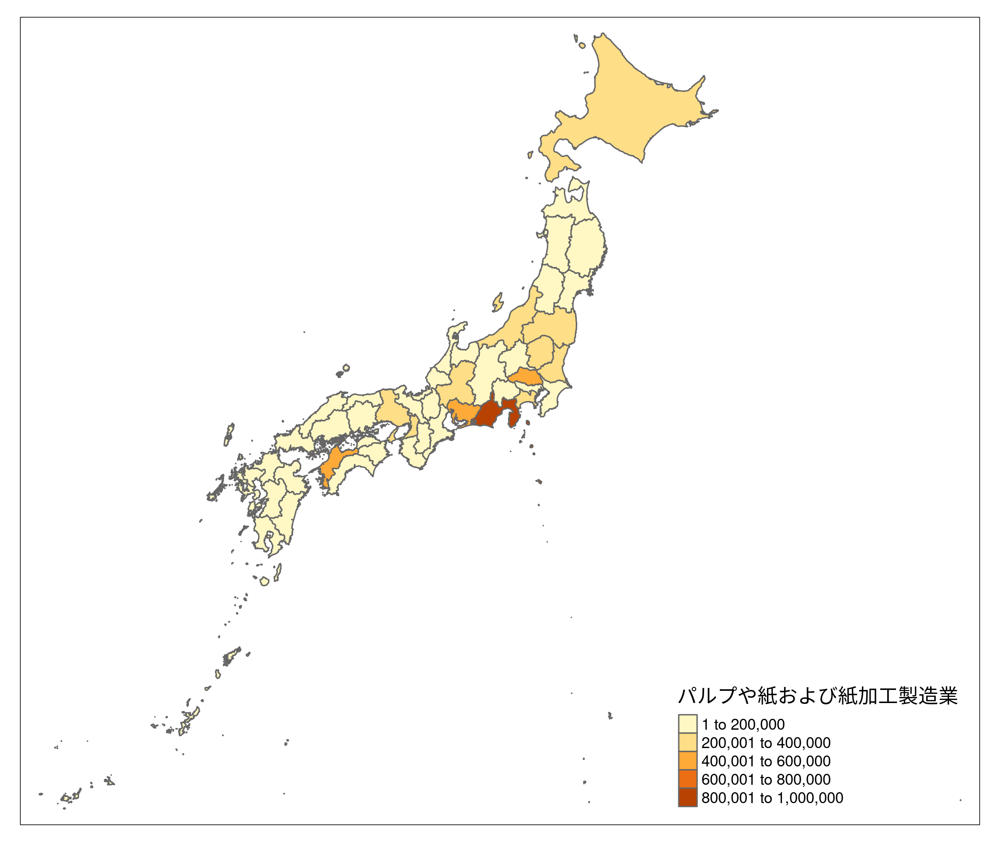
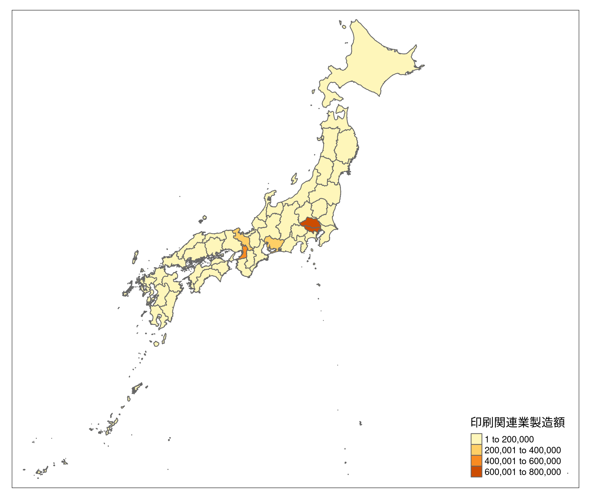
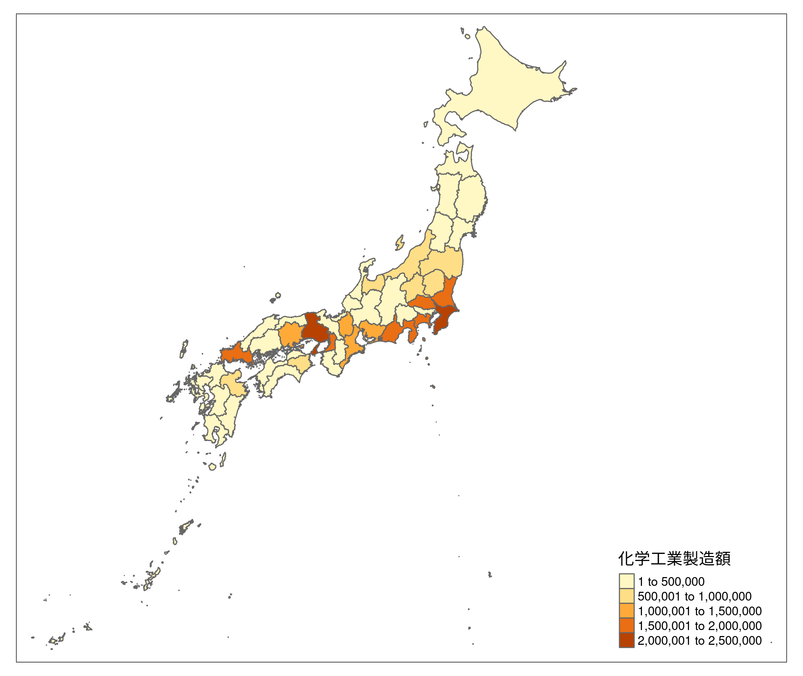
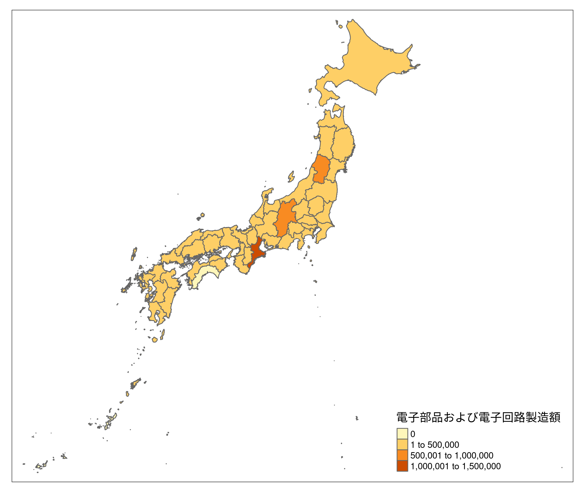
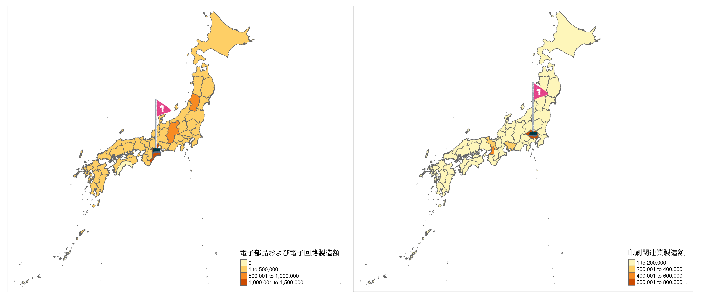

```{r setup, include=FALSE}
knitr::opts_chunk$set(echo = TRUE)
```

## 0. 要旨
日本の第二次産業は減少傾向にある。しかし、IT技術の導入など巻き返しを図ることができる可能性もあると考えられている。第二次産業のうち製造業に焦点を当て、分野別にどの地域での生産が多いのかをみてみたい。

## 1. はじめに
### 1.1 背景
日本の製造業は狭い国土の中全国さまざまな地域で営まれている。そこでは都道府県でどの分野の製造業が盛んなのかは異なるはずである。

### 1.2 目的
さまざまな分野の製造業の生産額を都道府県別で色分けし、特に多い地域についてなぜ生産額が大きくなっているのかを考察していく。

## 2. 手法
統計データから日本標準産業分類における6つの分野での各都道府県別の生産額を地図上で色分けをRおよびtmapを用いて行う。

## 3. データ
データは2020年度工業統計表地域別統計表より製造額を都道府県別に並び替えたものを作成し用いた。

## 4. 結果と考察
```{r library&package, include=FALSE}
library(maptools)
library(rgdal)
library(ggplot2)
library(sf)
library(dplyr)
library(tmap)
```

```{r Data_Input, include=FALSE}
shp <- read_sf("../data/JPN_adm1.shp")
data <- read.csv("../data/Industry2.csv")

JAP <- left_join(shp, data, by = c("NAME_1" = "Pre_name"))
JAP
```

```{r Map_Grocery, include=FALSE}
map1 = tm_shape(JAP) + tm_polygons(col = "食料品製造額")
tmap_save(tm = map1, filename = "Grocery.png")
``` 
```{r Fig_Grocery, out.width="70%", echo=FALSE}

```

まず食料品について見てみる。特に額が大きいのは北海道と埼玉県である。北海道は耕作面積が広く農業に適した環境が整っているため、埼玉県は東京都という第量消費地に近く近郊農業が盛んであるためだと考えられる。

```{r Map_Textile, include=FALSE}
map2 = tm_shape(JAP) + tm_polygons(col = "繊維工業製造額")
tmap_save(tm = map2, filename = "Textile.png")
``` 
```{r Fig_Textile, out.width="70%", echo=FALSE}

```

次に繊維工業についてみてみる。繊維工業の製造額が多いのは愛知県であることがわかるが、これは明治時代からトヨタをはじめ紡績工場が多く建設されてきた名残であると考えられる。

```{r Map_Wood, include=FALSE}
map3 = tm_shape(JAP) + tm_polygons(col = "パルプや紙および紙加工製造業")
tmap_save(tm = map3, filename = "Wood.png")
``` 
```{r Fig_Wood, out.width="70%", echo=FALSE}

```

次に紙やパルプについてみてみる。この分野では静岡県での製造額が多い。これは富士地域の豊富な水資源が大量の水を必要とする製紙産業やパルプ製造等の分野に最適だからであると考えられる。

```{r Map_Paper, include=FALSE}
map4 = tm_shape(JAP) + tm_polygons(col = "印刷関連業製造額")
tmap_save(tm = map4, filename = "Paper.png")
``` 
```{r Fig_Paper, out.width="70%", echo=FALSE}

```

次に印刷関連業についてみてみる。東京都と埼玉県での製造額が多いことがわかるが、東京都は純粋に消費する人数が多いこと、埼玉県は消費地に近いことが理由だと考えられる。

```{r Map_Chemical, include=FALSE}
map5 = tm_shape(JAP) + tm_polygons(col = "化学工業製造額")
tmap_save(tm = map5, filename = "Chemical.png")
``` 
```{r Fig_Chemical, out.width="70%", echo=FALSE}

```

次に化学工業についてみてみる。東日本では千葉県を筆頭に茨城県や埼玉県、神奈川県、静岡県が、西日本では兵庫県を中心に岡山県や大阪府の製造額が多いことがわかる。これはそれぞれ京浜工業地帯と阪神工業地帯に位置し、海外からの資源輸入後の輸送の手間のいらない沿岸地域に多いことからだと考えられる。

```{r Map_Electronic, include=FALSE}
map6 = tm_shape(JAP) + tm_polygons(col = "電子部品および電子回路製造額")
tmap_save(tm = map6, filename = "Electronic.png")
``` 
```{r Fig_Electronic, out.width="70%", echo=FALSE}

```

最後に電子部品および電子回路の生産についてみてみる。三重県の製造額が多いが、全国各地で製造されていることがわかる。近年発達著しいIT分野の基礎となる部品であるため全国で生産されていると考えられる。また、三重県で最も多く生産されているのは平成中期に産業の空洞化が危惧されていた四日市市が技術集積活用型産業再生特区に指定され政府から多くの支援があったからだと考えられる。

## 6. 結論
さまざまな分野の製造業がそれぞれの地域で特色をもちながら営まれていることが確認できた。

## 7. Graphic Abstract
レポートを表す１枚の図をここで示す。

```{r Fig_Graphic_Abstruct, out.width="110%", echo=FALSE}

```

## 8. 参考文献
・工業統計調査(https://www.meti.go.jp/statistics/tyo/kougyo/index.html)

・あいちの産業史(https://www.okashin.co.jp/local/jiba/pdf/pdf_industry.pdf)

・製紙業の歴史(https://www.city.fuji.shizuoka.jp/sangyo/c0304/fmervo00000084q7.html)

・四日市市の工業(http://www.yokkaichi-cci.or.jp/tianjin/03-1/)